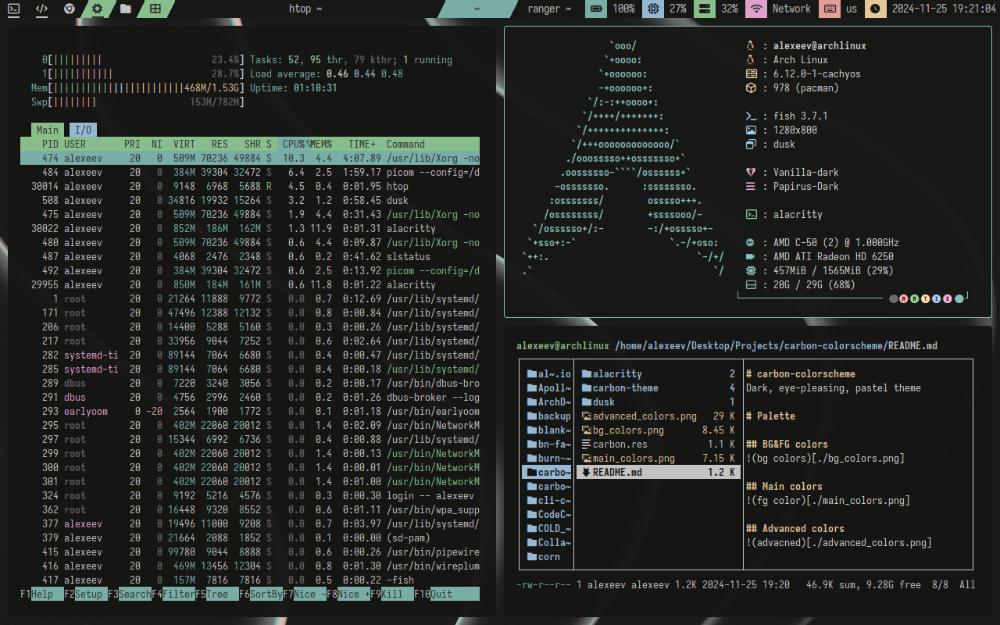
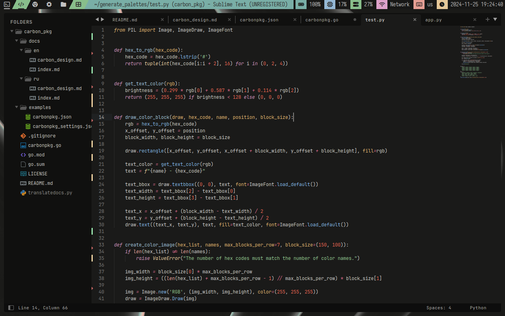
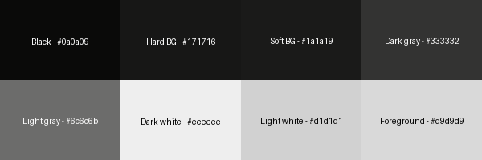
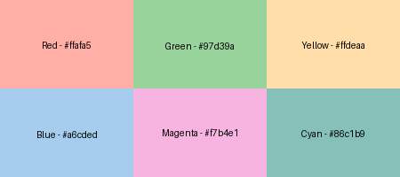
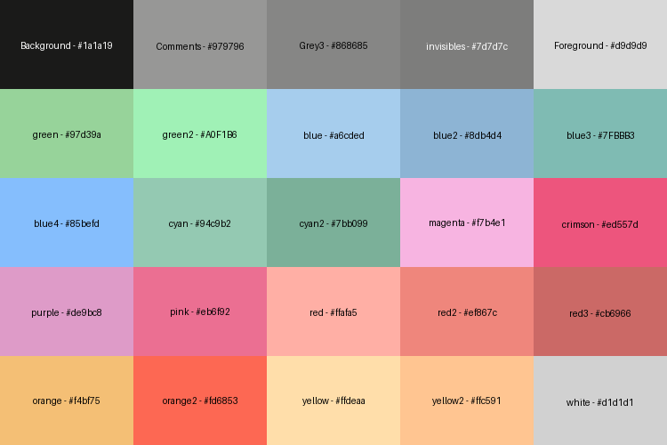

# carbon-colorscheme
Dark, eye-pleasing, pastel theme.


---





# Palette

## BG&FG colors


## Main colors


## Advanced colors


# GTK Theme
Copy `carbondark` to `~/.themes/carbondark`:

```bash
cp carbondark -r ~/.themes/
```

# NVIM Config CARBON-NVIM
Copy `nvim` to `~/.config/nvim`:

```bash
cp nvim -r ~/.config/
```

# Alacritty
Create `~/.config/alacritty/themes/carbon.toml`:

```toml
# Carbon Colorscheme
# By Alexeev Bronislav

[colors.primary]
background = '#171716'
foreground = '#d9d9d9'

[colors.normal]
black   = '#333332'
red     = '#ffafa5'
green   = '#97d39a'
yellow  = '#ffdeaa'
blue    = '#a6cded'
magenta = '#f7b4e1'
cyan    = '#86c1b9'
white   = '#d1d1d1'

[colors.bright]
black   = '#6c6c6b'
red     = '#ffafa5'
green   = '#97d39a'
yellow  = '#ffdeaa'
blue    = '#a6cded'
magenta = '#f7b4e1'
cyan    = '#86c1b9'
white   = '#eeeeee'
```

Add into `~/.config/alacritty/alacritty.toml`:

```toml
[general]
import = [
	"~/.config/alacritty/themes/carbon.toml"
```

# Sublime text
Copy `carbon-theme` to `~/.config/sublime-text/Packages/carbon-theme/`:

```bash
cp carbon-theme -r ~/.config/sublime-text/Packages/
```

# Dusk-wm
Copy `dusk/carbon.res` to `~/.config/dusk/themes/dark/carbon.res`:

```bash
cp dusk/carbon.res ~/.config/dusk/themes/dark/carbon.res
xrdb_reload.sh ~/.config/dusk/themes/dark/carbon.re
```
